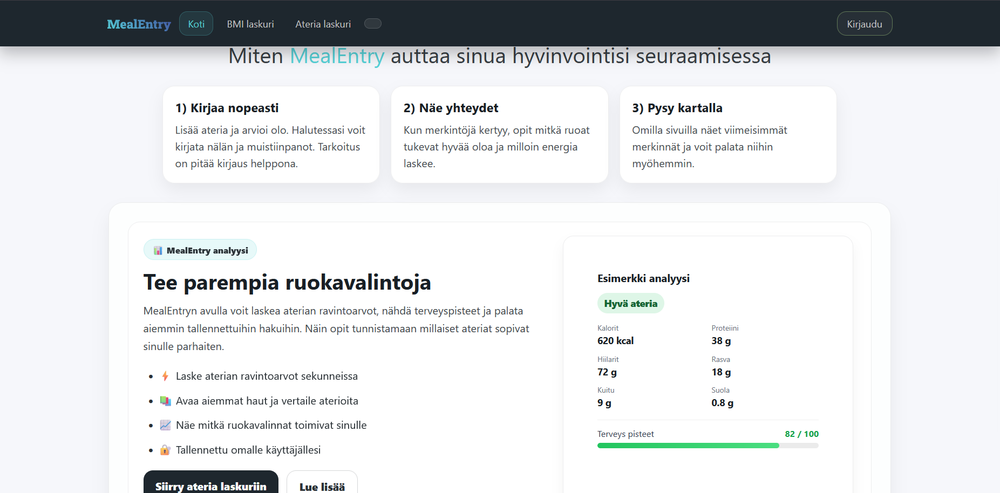
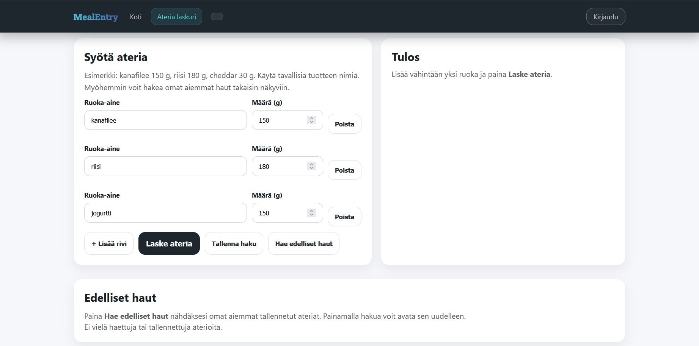
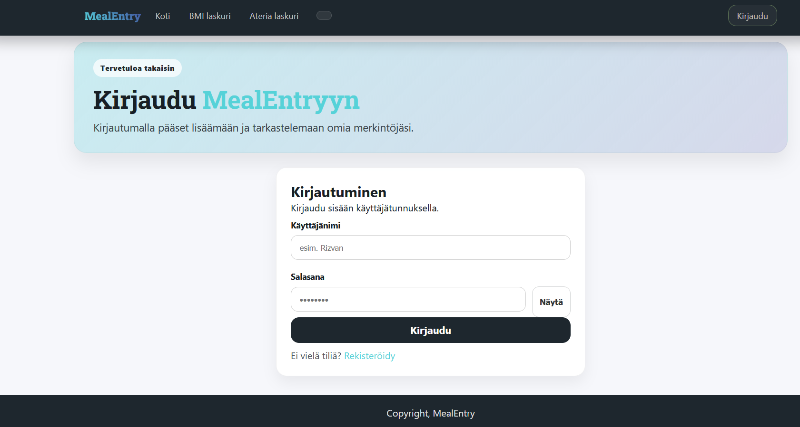
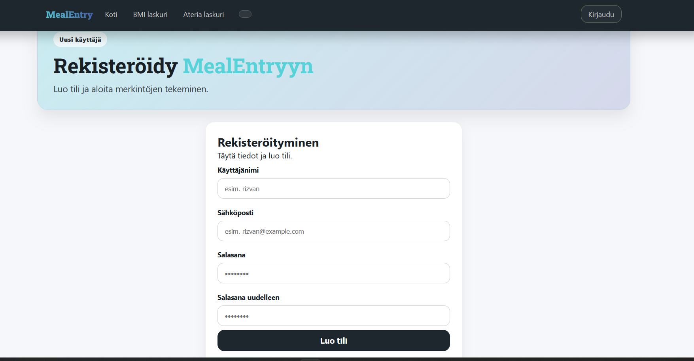
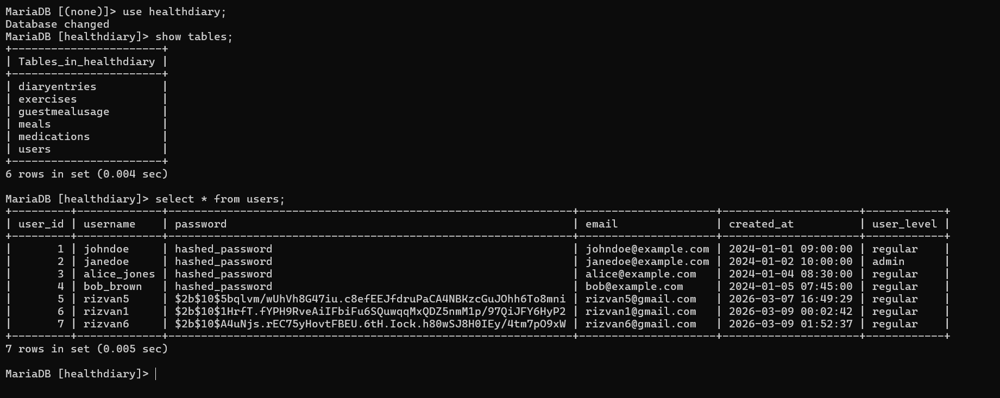

MealEntry

MealEntry on selainpohjainen hyvinvointisovellus, jonka avulla käyttäjä voi analysoida aterioita, tarkastella ravintoarvoja ja tallentaa omia ruokahakujaan. Sovellus auttaa ymmärtämään paremmin ruokavalintoja ja niiden vaikutuksia ravintoarvoihin. Käyttäjä voi rekisteröityä palveluun, kirjautua sisään ja tallentaa omia aterioitaan myöhempää tarkastelua varten.

Sovellus sisältää sekä front-end käyttöliittymän että back-end API:n. Front-end vastaa käyttöliittymästä ja käyttäjän toiminnasta, kun taas back-end huolehtii autentikoinnista, tietokantayhteyksistä ja datan tallennuksesta.

Ominaisuudet

Sovelluksen keskeisiä ominaisuuksia ovat:

Käyttäjän rekisteröityminen ja kirjautuminen

JWT-autentikointi käyttäjän tunnistamiseen

Ateria-analyysi ravintoarvojen laskemista varten

Aterioiden tallentaminen tietokantaan

Aiemmin tallennettujen aterioiden tarkastelu

Responsiivinen käyttöliittymä (toimii myös mobiilissa)

Vieraskäytön rajoitus (ilman kirjautumista voi analysoida aterian kolme kertaa)

Teknologiat
Front-end

Front-end on toteutettu seuraavilla teknologioilla:

HTML

CSS

JavaScript

Vite (kehityspalvelin)

Käyttöliittymä on rakennettu responsiiviseksi, jotta sovellus toimii eri kokoisilla näytöillä.

Back-end

Back-end on toteutettu Node.js-ympäristössä käyttäen Express-frameworkia.

Käytetyt teknologiat:

Node.js

Express

MariaDB

JWT (JSON Web Token) autentikointiin

Back-end tarjoaa REST-tyylisen API:n, jonka kautta front-end kommunikoi tietokannan kanssa.

Projektin rakenne
Front-end

HTML-sivut:

index.html

login.html

register.html

meal.html

bmi.html

JavaScript:

main.js

login.js

register.js

meal.js

api.js

fetch.js

CSS:

style.css

login.css

meal.css

bmi.css

Back-end

Back-end koostuu seuraavista osista:

Controllers:

auth-controller.js

meal-controller.js

user-controller.js

entry-controller.js

item-controller.js

Models:

user-model.js

meal-model.js

entry-model.js

item-model.js

Routers:

auth-router.js

meal-router.js

user-router.js

entry-router.js

item-router.js

Middlewares:

authentication.js

meal-limit.js

logger.js

Tietokanta

Tietokantana käytetään MariaDB:tä.

Tietokanta sisältää mm. seuraavat taulut:

Users

Meals

GuestMealUsage

Entries

Items

Meals-taulu tallentaa käyttäjän tekemät ateria-analyysit sekä ravintoarvot.

Asennus ja käynnistys
Back-end

Asenna riippuvuudet:

npm install

Käynnistä palvelin:

npm run dev

Back-end palvelin käynnistyy osoitteeseen:

http://127.0.0.1:3000

Front-end

Asenna riippuvuudet:

npm install

Käynnistä kehityspalvelin:

npm run dev

Front-end käynnistyy esimerkiksi osoitteessa:

http://127.0.0.1:5173

Mahdolliset bugit ja tunnetut ongelmat

Ateria-analyysi perustuu ulkoiseen ruokadatan API-hakuun, joten joillekin tuotteille ei välttämättä löydy täydellisiä ravintoarvoja.

Vieraskäytön rajoitus perustuu cookieen ja tietokantaan, joten rajoituksen voi kiertää esimerkiksi käyttämällä eri selainta.

Responsiivinen layout toimii pääasiassa hyvin, mutta joissain harvinaisissa näytön resoluutioissa elementtien asettelu voi hieman muuttua.

Referenssit ja käytetyt lähteet

Projektin toteutuksessa on käytetty seuraavia dokumentaatioita ja materiaaleja:

Node.js dokumentaatio
https://nodejs.org/en/docs

Express dokumentaatio
https://expressjs.com/

MariaDB dokumentaatio
https://mariadb.com/kb/en/documentation/

JWT dokumentaatio
https://jwt.io/

OpenFoodFacts API (ruokadata)
https://world.openfoodfacts.org/data

Lisäksi käyttöliittymän ja CSS-rakenteiden suunnittelussa on hyödynnetty seuraavia lähteitä:

MDN Web Docs

W3Schools

(Huomio AI:n käytöstä)

Tämän README-tiedoston sisältö on osittain tuotettu tekoälyavusteisesti (AI-generated), ja sitä on muokattu projektin tarpeiden mukaisesti.

Tekijä

Rizvan
Metropolia Ammattikorkeakoulu
Web-kehitys / Hyvinvointisovellusprojekti
